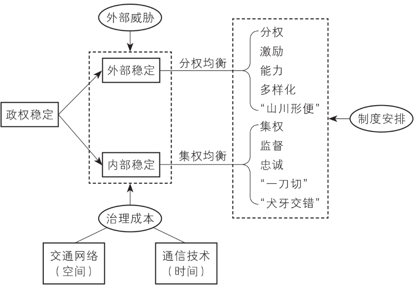
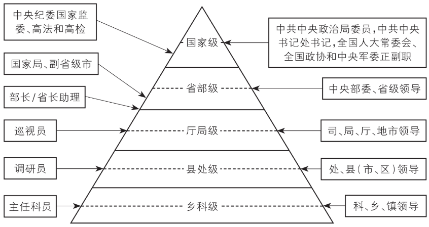
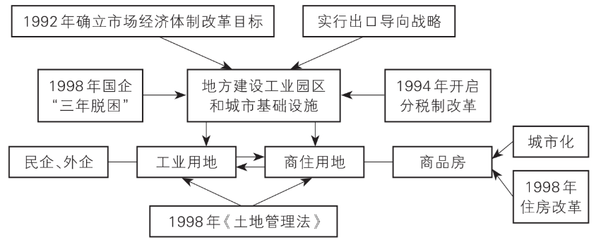

《基层中国的治理逻辑》是一本不错的书，作者是人民大学的经济学教授。本书采取 #政治经济学 、组织经济学视角，从国家治理、基层治理、个人抉择三个层面逐步深入，给了我观察基层 #公务员 的视角与切口，也影响了我的 #职业选择 。

## 1 缘起

读这本书缘起于入党的选择，有钱有势的亲戚告诫我一定要入，其余的亲人只能是劝我盲目随众，看来最终只能靠我自己了。曾经我会心高气傲，现在的我选择坦诚自己的局限性。我曾多次幻想拥有一双全知视角，给那个站在十字路口的，犹豫的，迷茫的，不安的小人儿一股强心剂，告诉我就朝着这个方向大步迈进吧，光明会在前方等着你的。但我终究等不来那样一双全知视角，我只能靠自己。

那就靠自己吧，主动去搜索信息，做出更谨慎，更忠于内心的选择，是我目前唯一能做的。

## 2 介绍

这本书起于宏观分析，第一部分的核心观点就告诉我们，当代中国的治理架构是条块结合、以块为主的中央集权体制，随后提出了内外冲突的双均衡分析框架，回答了诸如地区边界是如何形成的、古代为什么皇权不下县的问题。随后提出等级制是行政资源分配的主要方式。从城市级别到官员级别，再到政策制定，权斗体现了一个简单的道理：人随资源走，资源随权力走，权力在本质上是一个等级体系。

第二部分介绍权力的运行，作者先后介绍了县委书记、乡镇党委书记、街道办和行政村的权力清单和职位的含权量。这部分偏向科普性介绍，帮助年轻人在进入体制内时做出更理性的选择。

第三部分介绍基层的治理逻辑。地方主官中，县委书记的三座大山是维稳、招商、借债，乡镇党委书记的难题是安全稳定、迎检、民生问题，可以看出，对于基层来说，如何实现稳定才是最大的挑战。这也给我看待现在很多互联网新闻一个更有深度的切入口。此外还讨论了基层如何激励公务员干事，如何推动招商引资，何以催生土地财政以及如何应对债务危机。这里土地财政的介绍深入浅出，尤其配合《置身室内》一起阅读，会对中国经济发展与房地产市场发展有更加通透的认识。

## 3 摘录

下面摘录一些书中对值得深思的句子：

* 公说公有理，婆说婆有理；究竟谁有理，关键看逻辑；**逻辑要自洽，关键看框架**。
* **集权和分权**是两个均衡的制度体系：集权意味着监督、忠诚和大一统，而分权意味着激励、能力和多样化。
* 基层有想法但是没权力，要实现想法必须沿着权力金字塔，自下而上逐级推进——越级汇报是有风险的。
* 一个**职务的含权量**主要由三个因素决定：行政级别、管什么人、管多少钱。
* 中国的上下级、中央和地方之间是一种典型的**不完全契约**，即无法将双方在未来的所有权利和义务都一网打尽。此外属地管理的本质是**政治承包制**，即辖区内“一把手”实际上对本地区的所有事务负有领导责任。故而：**不完全契约 + 政治承包制 = 无限责任制 = 权力无边界**。
* 在自由择业和竞争压力下，均衡中所有岗位的净收益其实都是相等或相近的。世上没有完美的岗位。
* 进入乡镇公务员队伍的渠道主要是两个：一是参加省级公务员考试，考取相应岗位；二是选调生，包括中央部委的选调生和省级选调生，他们都要在乡镇锻炼两年。
* 乡镇公务员们，不管是晋升困境，还是压力困境和家庭困境，归根结底都是一种心态困境。心态好，才是真的好！
* 人的一半是天使，一半是魔鬼。**好的制度，就应该激发天使的一面，而遏制魔鬼的一面**。
* 几千年的文化传统决定了中国老百姓对政府的认知，政府就是为民做主的，还是凡事要找政府。
* 中国的意识形态和传统文化决定了中国政府是**全能政府**，不是“小政府”。
* 乡镇公务员比部委公务员升迁更慢，但部委公务员会反问：**如果你觉得部委公务员更好，当初为什么不参加国考呢？**
* 在一个“条块结合，以块为主”的治理架构下，考核指标是不同的行政单位为了争夺“注意力分配”，以便获得更多的控制权的收益的必然结果。

  * 首先，在一个自上而下的权力科层中，考核就是指挥棒。本部门也从具体的工作落实部门变成了督察部门，实现**压力向下传到，指标向下分解**。
  * 其次，党委和政府主要领导的注意力是有限的，不可能每件事都关注，更不可能把所有资源平均分配到每件事情上。
  * 再次，考核指标纳入考核范围后，强势的部门会凭借自己的政治地位和个人能力，进一步把本部门的业绩从一般的考核指标上升为“一票否决”指标，这样下级单位在诸多指标中就优先考虑这些指标。
  * 最后，某些指标一旦纳入了考核范围，就有“**棘轮效应**”，想减下来就难了。
* **从强调激励转向强调监督，从政绩驱动转向问责驱动**，这两个转变在本质上是数字技术对国家治理的影响，符合“内外冲突的双均衡分析框架”。
* **土地财政**背后的经济学逻辑：地方政府一方面通过低价出让工业用地，吸引企业入驻，拉动工业增长，另一方面又通过高价出让商住用地，活得大量土地出让金，然后再进一步改善基础设施和城市环境，并对工业用地进行交叉补贴，地方政府就此实现了一个“完美的闭环”。
* 好的营商环境能减少不确定性，坏的营商环境本身就是一种不确定性。

理解了基层中国的治理逻辑，再去理解很多公务员的行为逻辑就有分析的切入点了，也更能够理解当下公务员的生存环境。总之，这本书值得一读。
