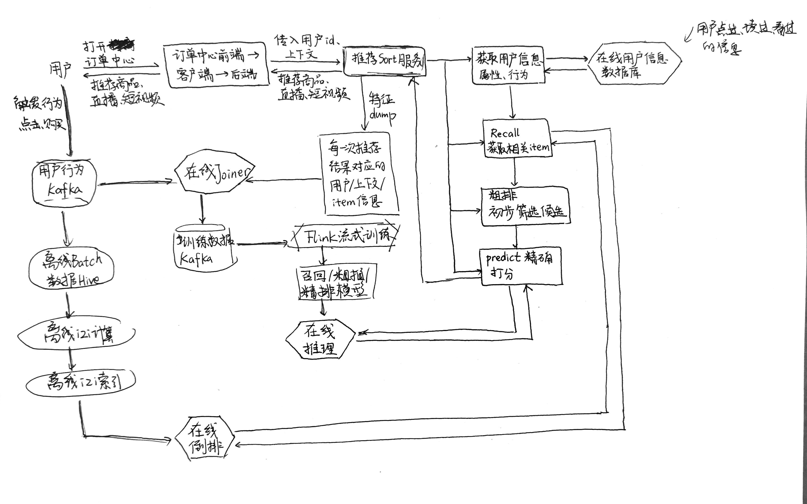

我们用一幅图展现 #推荐系统 架构在工业界的实现流程。该架构通过**在线实时预测**满足用户的瞬时需求，同时通过**离线和流式训练**不断优化预测的准确性，形成一个数据驱动的持续进化系统。这对于理解整个推荐系统以及 #大数据工具 都很有帮助。

* 用户交互与前端触发
  1. 用户行为：打开APP订单中心或浏览首页，触发请求
  2. 推荐Sort服务：接收用户的ID和当前上下文（如时间、地理位置、设备类型），并负责最终返回推荐结果（商品、直播、短视频）
* 在线推荐流水线
  1. 获取用户信息：从在线用户信息数据库中提取用户的静态属性和近期的动态行为。
  2. 召回：从海量内容库（千万级）中快速筛选出几百个用户可能感兴趣的候选集。
  3. 粗排：对召回的内容进行初步筛选，剔除不合适的，缩小范围。
  4. 精排/打分：利用深度学习模型对候选内容进行精确打分，预测用户的点击率或转化率。
* 数据流与特征工程
  1. 特征dump：系统会将每一次推荐给用户的结果、当时的上下文以及内容信息记录下来，形成原始日志。
  2. 在线Joiner：将用户的实时行为（点击、购买、点赞）与之前的推荐记录“拼接”在一起。这能告诉模型：“刚才我推了这个视频，用户确实看了。”
  3. #Kafka ：作为信息中间件，处理海量的实时行为数据流。
* 离线与流式训练
  1. 离线Batch数据（Hive）：存储海量的历史数据，用于长周期的离线训练和item-to-item计算（比如计算两个视频的相似度）。
  2. #Flink 流式训练：这是实现“分钟级”甚至“秒级”更新的关键。通过Flink处理实时流，模型可以迅速捕捉到用户当下的兴趣转变。
  3. 模型库：训练好的召回、粗排、精排模型会被推送到在线推理引擎中，供上述推荐流水线调用。

补充：针对第二部分，即在线推荐流水线，有如下问题：

*1、请问推荐系统从在线数据库获取用户信息，与前一部分推荐Sort接收用户ID和上下文信息是否矛盾？或者说用户ID和上下文信息一方面进入了推荐Sort服务，另一方面进入在线用户信息数据库？*

答：推荐Sort服务接收的信息是请求的引子，比如用户打开APP的瞬间，客户端发给服务器的只有用户ID和简单的上下文（时间、位置、5G信号），而在线用户信息数据库存储的是用户的画像特征。

用户ID进入Sort服务后，服务会拿着这个ID去在线数据库“刷卡”，数据库返回该用户的长期标签（如性别、职业、历史类目偏好）和短期行为(如过去10分钟看过的视频id)。

*2、图中召回部分与“在线倒排”模块有交互，具体在做什么？*

答：“在线倒排”是召回阶段的搜索引擎。召回的目标是从千万级的内容中选出几百个候选，直接遍历所有视频是不可能的，召回模块发送一个检索信号（如特征向量或标签），在线倒排模块像查字典一样，瞬间返回一批相关的视频列表。

比如你刚才看了一个“猫咪”视频，召回模块会通过“在线倒排”寻找关键词为“宠物”、“萌宠”的内容列表，或者寻找与刚才视频ID相似的视频池。

*3、图中精排部分与“在线推理”模块有交互，又是具体在做什么？此外，精排/打分部分问什么说就一定是利用深度学习模型呢，为什么要预测用户的点击率或转化率呢？这个深度模型怎么训练来的呢？*

答：（1）精排是逻辑层，在线推理是计算执行层。精排模块将“用户特征”和“几百个候选视频”打包发送给在线推理引擎。推理引擎加载训练好的神经网络模型，进行大规模的矩阵运算，最后给每个视频吐出一个0到1之间的分数，代表感兴趣的概率。

（2）虽然也可以用传统的机器学习（如逻辑回归），但现在主流一定是深度学习，因为DL可以处理海量特征以及非线性特征组合。

（3）推荐系统本质上效率最大化，点击率衡量用户是否感兴趣（是否点开），转化率衡量用户是否产生价值（会不会买/关注），通过预测这些概率，系统可以将概率最大的放在最上面，从而保证平台流量不被浪费。

（4）深度模型的训练涉及图中的离线/流式训练闭环。首先，系统记录下推给你的视频（特征）和你是否点击了（标签），然后将数亿条这类样本输入GPU集群，利用优化算法不断调整模型里的权重，让模型的预测值越来越接近用户的真实表现，最后将训练好的权重文件保存并推送到在线推理模块中，完成一次进化。
